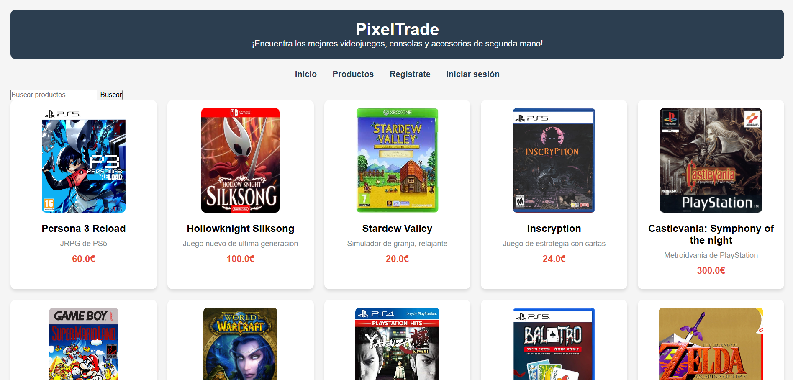
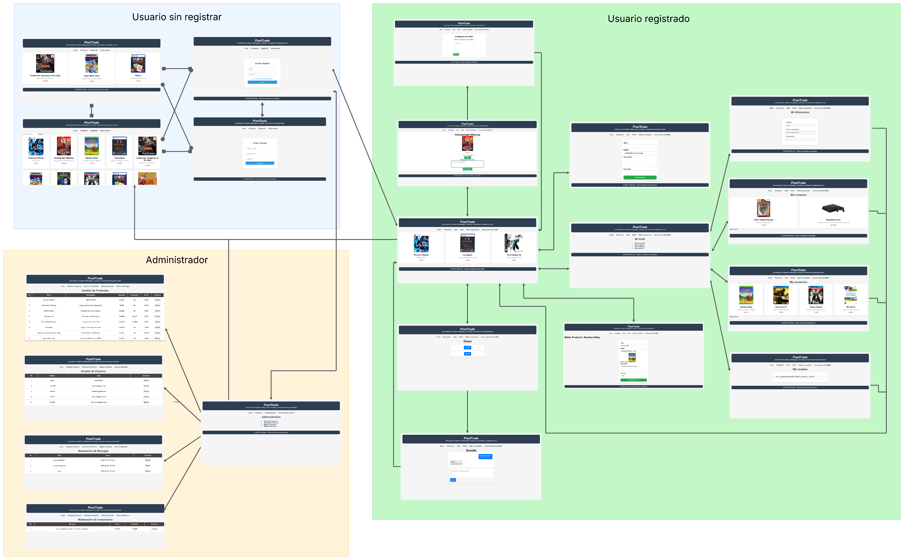

# Nombre de la aplicación: PixelTrade
## Integrantes del grupo
| Nombre  | Apellido  | Correo                     | GitHub  |
|---------|-----------|----------------------------|---------|
| Tayson  | Pérez Bernaerts  | ti.perez.2022@alumnos.urjc.com    | [GitHub1](https://github.com/Taysonpb) |
| Daniel  | Muñoz Martínez   | d.munozm.2022@alumnos.urjc.es     | [GitHub2](https://github.com/danielmunmar) |
| Martín  | Gutiérrez Parada | m.gutierrezp.2022@alumnos.urjc.es | [GitHub3](https://github.com/martingutpar) |

## Aspectos Principales
### Entidades: 
Usuario, producto, mensaje y review. Todas las entidades tienen dos relaciones 1 a N con la entidad usuario. Esto se debe a que un usuario compra y vende N productos, al igual que envía y recibe N mensajes y reseñas.

### Permisos de los usuarios:  
- Anónimo: puede consultar información de los productos.
- Usuario registrado: puede consultar información de los produuctos, puede comprar y vender productos, enviar y recibir mensajes y poner y recibir reviews. También pueden acceder a su perfil donde tienen su información de cuenta, un listado de productos a la venta y comprados y pueden ver las reviews recibidas.
- Administrador: tiene permisos para borrar productos, mensajes y reviews. Además puede borrar usuarios con lo cuál se eliminan todas las entidades asociadas a esa cuenta.

### Imágenes
La entidad producto tiene una imagen asociada.

## Navegación
- Inicio: página inicial desde la que se puede acceder a todo el resto de funciones.

- Productos: página con todos los productos incluyendo un buscador.

- Página producto: página específica de cada producto para comprarlo o enviar mensajes a su vendedor.

- Subir un producto: página para subir un producto seleccionando una imagen.

- Poner review: págian que aparece tras comprar un producto para poner una review a su vendedor.

- Chat: página de chat con un contacto específico para enviar mensajes.

- Perfil: página para acceder a las funciones de mi perfil.

- Información personal: página con la información del usuario.

- Compras realizadas: página con el historial de compras.

- Productos a la venta: página con listado de mis productos.

- Ver Reviews: página con las reviews que he recibido.

- Menú admin: menú con todas las opciones del administrador.

- Gestión usuarios: página para la gestión de usuarios.

- Gestión productos: página para la gestión de productos.

- Moderar reseñas: página para la moderación de reseñas.

- Moderar mensajes: página para la moderación de mensajes.

## Diagrama de navegación

## Diagrama de entidades

## Diagrama de clases y templates

## Participación de miembros
Cabe destacar que hemos trabajado generalmente en grupo todos en un mismo ordenador por lo que muchos de los commits asociados a una cuenta específica son desarrollados por todos, al igual que los ficheros creados.
### Martín Gutiérrez Parada

- **Tareas:**  Gestión de la sesión de los usuarios, subir imágenes en un producto, todas las funciones relacionadas con los mensajes, creación de htmls y css, header y footer, diseños de páginas, codificación de métodos de los controladores, diagramas de entidades y navegación, desarrollo de la documentación.

- **5 commits más significativos:**  
    - [Commit 1](https://github.com/SSDD-2025/practica-sistemas-distribuidos-2025-grupo-12/commit/24b955c4ecb21f694ed85e6669a3ef802a64ff4e)
    - [Commit 2](https://github.com/SSDD-2025/practica-sistemas-distribuidos-2025-grupo-12/commit/ce0a39a30d7ab4caa5fbe67f2277e48ac81d08c7)
    - [Commit 3](https://github.com/SSDD-2025/practica-sistemas-distribuidos-2025-grupo-12/commit/a5ae870387073b9abaf45c69dc265b236a0bec5f)
    - [Commit 4](https://github.com/SSDD-2025/practica-sistemas-distribuidos-2025-grupo-12/commit/5f9985cd6f69574831add4332c665d7c1eb01f3b)
    - [Commit 5](https://github.com/SSDD-2025/practica-sistemas-distribuidos-2025-grupo-12/commit/cf39df9788521109389c68506b3f7f8ae2301993)
 

- **5 ficheros en los que se ha participado:**  
    - [Fichero 1](https://github.com/SSDD-2025/practica-sistemas-distribuidos-2025-grupo-12/blob/main/pixeltrade/src/main/java/es/grupo12/controller/MessageWebController.java)
    - [Fichero 2](https://github.com/SSDD-2025/practica-sistemas-distribuidos-2025-grupo-12/blob/main/pixeltrade/src/main/java/es/grupo12/controller/UserWebController.java)
    - [Fichero 3](https://github.com/SSDD-2025/practica-sistemas-distribuidos-2025-grupo-12/blob/main/pixeltrade/src/main/java/es/grupo12/model/Message.java)
    - [Fichero 4](https://github.com/SSDD-2025/practica-sistemas-distribuidos-2025-grupo-12/blob/main/pixeltrade/src/main/resources/static/style1.css)
    - [Fichero 5](https://github.com/SSDD-2025/practica-sistemas-distribuidos-2025-grupo-12/blob/main/pixeltrade/src/main/resources/templates/chat.html)

 ### Tayson Pérez Bernaerts

- **Tareas:**  Gestión de productos, todo lo relacionado con subir productos, ver la página del producto, compra, edición, recomendados, búsqueda... Código del controlador de productos, repositorio y servicio. Conexión de la aplicación con la base de datos e instalación de dependencias necesarias. Creación de administrador con funciones iniciales. Creación del diagrama de clases y templates.

- **Tareas Práctica 2:** Conexión HTTPS con la página, añadido CSFR, roles de usuarios (USER, ADMIN), encriptado de contraseñas, todo lo relacionado con el apartado de seguridad de la aplicación. Colaborado con el creamiento de varios controladores REST. Creación de la colección postman con operaciones de consulta GET, POST, DELETE, PUT. Actualización del diagrama de clases y templates.

- **5 commits más significativos:**
    - [Commit 1](https://github.com/SSDD-2025/practica-sistemas-distribuidos-2025-grupo-12/commit/d11f2e0d2da1f6e5f4afd061074d6958e315ec75)
    - [Commit 2](https://github.com/SSDD-2025/practica-sistemas-distribuidos-2025-grupo-12/commit/71bbe4883f1fb20f13570287470afd8df4e1f99c)
    - [Commit 3](https://github.com/SSDD-2025/practica-sistemas-distribuidos-2025-grupo-12/commit/59ae9075618b2ceaf1d47da49156ab7f67d392e6)
    - [Commit 4](https://github.com/SSDD-2025/practica-sistemas-distribuidos-2025-grupo-12/commit/ae33245c6f9c8cc89022d2c1f13788e54adc8e55)
    - [Commit 5](https://github.com/SSDD-2025/practica-sistemas-distribuidos-2025-grupo-12/commit/93884f8346838bd4b9546ea55d939cd848ab13db)
 

- **5 ficheros en los que se ha participado:**  
    - [Fichero 1](https://github.com/SSDD-2025/practica-sistemas-distribuidos-2025-grupo-12/blob/main/pixeltrade/src/main/java/es/grupo12/controller/ProductWebController.java)
    - [Fichero 2](https://github.com/SSDD-2025/practica-sistemas-distribuidos-2025-grupo-12/blob/main/pixeltrade/src/main/java/es/grupo12/model/Product.java)
    - [Fichero 3](https://github.com/SSDD-2025/practica-sistemas-distribuidos-2025-grupo-12/blob/main/pixeltrade/src/main/java/es/grupo12/repository/ProductRepository.java)
    - [Fichero 4](https://github.com/SSDD-2025/practica-sistemas-distribuidos-2025-grupo-12/blob/main/pixeltrade/src/main/java/es/grupo12/service/ProductService.java)
    - [Fichero 5](https://github.com/SSDD-2025/practica-sistemas-distribuidos-2025-grupo-12/blob/main/pixeltrade/src/main/resources/static/style1.css)
 
  **PRÁCTICA 2**
  - **5 commits más significativos:**
    - [Commit 1](https://github.com/SSDD-2025/practica-sistemas-distribuidos-2025-grupo-12/commit/db2593a6ab14d564ce9b8ccca6a9b968128cdd71)
    - [Commit 2](https://github.com/SSDD-2025/practica-sistemas-distribuidos-2025-grupo-12/commit/069a1c772f4a9f6d215c92ad3f58a4b67c5f7ac0)
    - [Commit 3](https://github.com/SSDD-2025/practica-sistemas-distribuidos-2025-grupo-12/commit/219ba8d2a789f314d96e9b20dc088ffccd793d90)
    - [Commit 4](https://github.com/SSDD-2025/practica-sistemas-distribuidos-2025-grupo-12/commit/e2e823d91f7ce27c471d582aee4a3babe7b3188a)
    - [Commit 5](https://github.com/SSDD-2025/practica-sistemas-distribuidos-2025-grupo-12/commit/9fe2d938c2bbfaefcfc6ca62f9793b9b19661c0e)
   
  - **5 ficheros en los que se ha participado:**
    - [Fichero 1](https://github.com/SSDD-2025/practica-sistemas-distribuidos-2025-grupo-12/blob/main/pixeltrade/src/main/java/es/grupo12/security/SecurityConfig.java)
    - [Fichero 2](https://github.com/SSDD-2025/practica-sistemas-distribuidos-2025-grupo-12/blob/main/Postman%20collection.postman_collection.json)
    - [Fichero 3](https://github.com/SSDD-2025/practica-sistemas-distribuidos-2025-grupo-12/blob/main/pixeltrade/src/main/java/es/grupo12/controller/rest/MessageRestController.java)
    - [Fichero 4](https://github.com/SSDD-2025/practica-sistemas-distribuidos-2025-grupo-12/blob/main/pixeltrade/src/main/java/es/grupo12/controller/rest/ProductRestController.java))
    - [Fichero 5](https://github.com/SSDD-2025/practica-sistemas-distribuidos-2025-grupo-12/blob/main/pixeltrade/pom.xml)

### Daniel Muñoz Martínez

- **Tareas:**  Gestión de la sesión de los usuarios, persistencia de las imágenes en BD mySQL, todas las funciones relacionadas con las reseñas, creación de htmls de (inicio sesión, registro, relacionados con el perfil y admin...), gestión del usuario admin (consulta y borrado entidades), codificación de métodos de los controladores (principalmente en las clases User, Review y Product) y desarrollo de documentación.

- **5 commits más significativos:**  
    - [Commit 1](https://github.com/SSDD-2025/practica-sistemas-distribuidos-2025-grupo-12/commit/e905e0f33fb5c00e49011f401fa5a2d27ef62dc4)
    - [Commit 2](https://github.com/SSDD-2025/practica-sistemas-distribuidos-2025-grupo-12/commit/d15d715fbe3bf8f34827fb9927c26f10939cb97d)
    - [Commit 3](https://github.com/SSDD-2025/practica-sistemas-distribuidos-2025-grupo-12/commit/9a7b4f3b65680cb04abffdc9b39171157aff8aaa)
    - [Commit 4](https://github.com/SSDD-2025/practica-sistemas-distribuidos-2025-grupo-12/commit/96b59f31ac292c3ffa7000b70372811ba637f064)
    - [Commit 5](https://github.com/SSDD-2025/practica-sistemas-distribuidos-2025-grupo-12/commit/c805bee2a2f7bb5300bcea13aee0d6ebc0decd31)
 

- **5 ficheros en los que se ha participado:**  
    - [Fichero 1](https://github.com/SSDD-2025/practica-sistemas-distribuidos-2025-grupo-12/blob/main/pixeltrade/src/main/java/es/grupo12/controller/ReviewWebController.java)
    - [Fichero 2](https://github.com/SSDD-2025/practica-sistemas-distribuidos-2025-grupo-12/blob/main/pixeltrade/src/main/java/es/grupo12/controller/ProductWebController.java)
    - [Fichero 3](https://github.com/SSDD-2025/practica-sistemas-distribuidos-2025-grupo-12/blob/main/pixeltrade/src/main/java/es/grupo12/model/Review.java)
    - [Fichero 4](https://github.com/SSDD-2025/practica-sistemas-distribuidos-2025-grupo-12/blob/main/pixeltrade/src/main/java/es/grupo12/controller/UserWebController.java)
    - [Fichero 5](https://github.com/SSDD-2025/practica-sistemas-distribuidos-2025-grupo-12/blob/main/pixeltrade/src/main/java/es/grupo12/service/UserService.java)

---

## Instrucciones de ejecución:

1. Descargar este repositorio
2. Abrir XAMPP e iniciar servers de Apache y MySQL
3. Crear una base de datos en MySQL llamada prueba_distribuidos
4. Ejecutar desde vscode
5. Entrar a la página desde https://localhost:8443
6. Usar el software Postman para importar el archivo de la colección

### Instalaciones
- Java 21
- Visual Studio Code
- Maven 4.0
- XAMPP 8.2.4
- Spring Boot 3.4.2
- Postman
